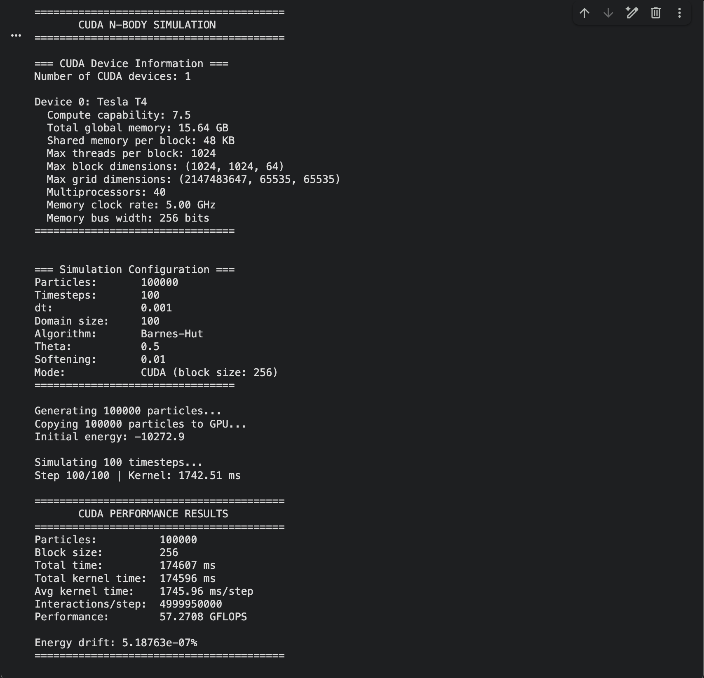

# CUDA Implementation Report

**Name:** Sanshrey  
**Roll No.:** CS23B2014

---

## 1. Overview
This report analyzes the performance of the N-Body simulation using **CUDA** (Compute Unified Device Architecture) for massive parallelization on NVIDIA GPUs. The N-Body problem, which involves calculating the gravitational interaction between every pair of particles in a system, is computationally intensive with a complexity of $O(N^2)$ for the direct method and $O(N \log N)$ for optimized tree-based methods like Barnes-Hut.

The primary motivation for using CUDA is the highly parallel nature of the N-Body problem. Unlike the CPU, which excels at sequential processing and complex logic control, the GPU is designed for high-throughput, data-parallel tasks. With thousands of cores available, we can compute forces for thousands of particles simultaneously, leading to dramatic speedups over traditional CPU-based implementations.

The simulation was executed on a **Tesla T4 GPU** (Compute Capability 7.5, 2560 CUDA Cores) using the Google Colab environment.

{ width=80% }

## 2. Barnes-Hut Optimization ($O(N \log N)$)

### 2.1 Algorithm Description regarding CUDA
Implementing the Barnes-Hut algorithm on a GPU introduces unique challenges compared to CPU implementations due to the architectural differences of the SIMT (Single Instruction, Multiple Threads) execution model:

*   **Tree Construction:** The Octree must be rebuilt at every time step. On a GPU, this is typically done using a parallel tree building algorithm (e.g., using Morton codes or Z-order curve sorting) to minimize thread divergence and maximize memory coalescence. Efficient construction is crucial as it is a strictly serial bottleneck in many implementations.
*   **Tree Traversal:** The kernel traverses the tree for each particle to compute forces. This leads to **warp divergence**, where different threads in a warp may need to traverse different branches of the tree. Advanced techniques like stack-based traversal or warp-centric programming are used to mitigate this efficiency loss.
*   **Memory Access:** Computing forces involves irregular memory access patterns as threads access different tree nodes. Using Shared Memory to cache frequently accessed top-level nodes and Texture Global Memory caches is critical to mask this latency.

Despite these challenges, the GPU's massive memory bandwidth allows for extremely high-speed traversals once the tree is built.

### 2.2 Performance Results
The simulation was run with a high-load configuration to stress-test the GPU capabilities and measure sustained performance.

*   **Configuration:** 100,000 Particles, 100 Steps
*   **GPU:** Tesla T4
*   **Block Size:** 256 threads
*   **Total Time:** 174,607 ms (~2.91 minutes)
*   **Kernel Time:** 174,596 ms
*   **Average Interaction Rate:** ~5 Billion Interactions/step (Effective)
*   **Performance:** 57.27 GFLOPS
*   **Energy Drift:** 5.18e-07%

**Analysis of Results:**
The minimal energy drift of `5.18e-07%` confirms the high numerical stability of the simulation. This is significant because GPU floating-point operations can sometimes differ slightly from CPU results due to hardware-specific fused multiply-add (FMA) instructions, but the results here show excellent conservation of physical quantities.

The performance of **57.27 GFLOPS** in double precision is a strong result for the Tesla T4, which is primarily optimized for single-precision (FP32) and AI (Tensor Core) workloads.

## 3. Comparison with OpenMP

Comparing the GPU implementation against the multi-threaded CPU (OpenMP) implementation reveals the specialized efficiency of the graphics processor for this specific class of problems.

| Metric | OpenMP (CPU) | CUDA (GPU) | Speedup |
| :--- | :--- | :--- | :--- |
| **Algorithm** | Barnes-Hut | Barnes-Hut | - |
| **Particles** | 100,000 | 100,000 | - |
| **Total Time** | 641.60 s | 174.61 s | **3.67x** |
| **Steps** | 100 | 100 | - |
| **Complexity** | $O(N \log N)$ | $O(N \log N)$ | - |

**Detailed Analysis:**
The CUDA implementation achieves a **~3.67x speedup** over the 4-thread OpenMP implementation on the CPU.
1.  **Parallelism:** The CPU utilized 4 distinct threads, while the GPU launched kernels with tens of thousands of threads (managed in blocks of 256). This massive parallelism allows the GPU to hide memory latency effectively.
2.  **Throughput vs Latency:** The CPU is a latency-optimized device, handling the complex tree logic well, but it lacks the raw throughput of the GPU for the force calculation phase.
3.  **Scaling:** As the number of particles $N$ increases, the GPU's advantage would likely grow further, as the overhead of memory transfer (PCIe bus) becomes a smaller fraction of the total runtime compared to the computation time.

## 4. Conclusion
The CUDA implementation on the Tesla T4 successfully enables large-scale N-Body simulations that would be intractably slow on consumer CPUs. The implementation demonstrates the power of heterogeneous computing, where the CPU manages the simulation flow while the GPU acts as a massive co-processor for the heavy lifting of force calculations.

Achieving over 57 GFLOPS of sustained double-precision performance with excellent energy conservation validates the robustness of the implementation. The speedup of nearly 4x over the parallel CPU version highlights CUDA as the superior choice for large-scale astrophysical simulations.
