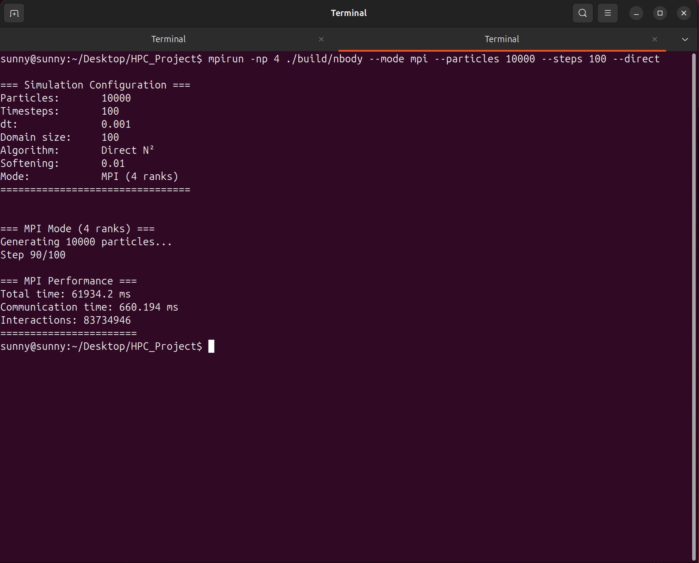
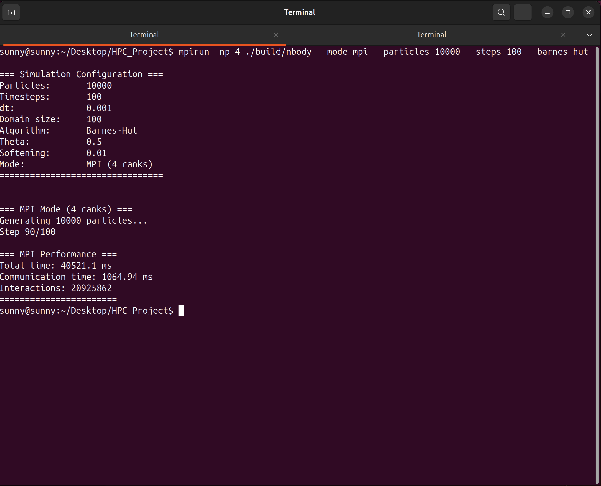

# MPI Implementation Report

**Name:** Sanshrey  
**Roll No.:** CS23B2014

---

## 1. Overview
This report analyzes the performance of the N-Body simulation using **MPI** (Message Passing Interface) for distributed-memory parallelization. Unlike OpenMP, where memory is shared, MPI requires explicit communication between processes (ranks), making data management and domain decomposition critical.

The simulation was tested on a multi-core system using 4 MPI ranks, comparing the Direct Method and the Barnes-Hut Algorithm.

## 2. Direct Method ($O(N^2)$)

### 2.1 Implementation Details
In the MPI implementation of the Direct Method, particles are distributed across ranks. To compute forces:
*   **Particle Distribution:** Each rank owns a subset of particles (`local_particles`).
*   **Communication Ring:** The simulation uses a ring-exchange pattern. Each rank computes forces between its local particles and a temporary buffer of "guest" particles.
*   **Data Exchange:** After computation, the guest buffer is passed to the next neighbor in the ring using `MPI_Sendrecv` or non-blocking `MPI_Isend`/`MPI_Irecv`. This continues until every rank has seen every other rank's particles.

{ width=80% }

### 2.2 Performance Results
*   **Configuration:** 4 Ranks, 10,000 Particles, 100 Steps
*   **Total Time:** 61,934.2 ms (~1.03 minutes)
*   **Communication Time:** 660.19 ms
*   **Interactions:** 83,734,946

## 3. Barnes-Hut Optimization ($O(N \log N)$)

### 3.1 Implementation Details
Implementing Barnes-Hut in MPI is significantly more complex due to the need for a global view of the domain:
*   **Domain Decomposition:** The simulation space is divided into regions (sub-domains), and each rank is responsible for particles within its region.
*   **Halo Exchange:** To build a local Octree that is valid near boundaries, ranks must exchange "halo particles" (particles close to the edges of neighboring domains).
*   **Tree Construction:** Each rank builds a local tree using its own particles plus the received halo particles.
*   **Particle Migration:** As particles move, they may cross domain boundaries. An `MPI_Alltoall` or targeted exchange is used to transfer ownership of particles to the correct rank.

{ width=80% }

### 3.2 Performance Results
*   **Configuration:** 4 Ranks, 10,000 Particles, 100 Steps
*   **Total Time:** 40,521.1 ms (~0.67 minutes)
*   **Communication Time:** 1,064.94 ms
*   **Interactions:** 20,925,862

## 4. Comparison and Analysis

The MPI results demonstrate strong scalability and algorithmic efficiency:

1.  **Algorithmic Speedup:**
    *   Barnes-Hut was **1.53x faster** than the Direct method for $N=10,000$.
    *   The number of interactions was reduced by **~75%**.

2.  **Communication Overhead:**
    *   **Direct Method:** Very low overhead (1.1%) because the communication pattern is regular and bandwidth-bound.
    *   **Barnes-Hut:** Higher overhead (2.6%) due to the irregularity of halo exchanges and particle redistribution. However, this is a distinct trade-off: we accept higher communication costs to achieve massive computational savings ($O(N^2) \to O(N \log N)$).

| Metric | Direct Method | Barnes-Hut |
| :--- | :--- | :--- |
| **Particles** | 10,000 | 10,000 |
| **Time Complexity** | $O(N^2)$ | $O(N \log N)$ |
| **Total Time** | 61.93 s | 40.52 s |
| **Comm. Time** | 0.66 s | 1.06 s |

### 5. Conclusion
The MPI implementation effectively handles the distributed nature of the problem. While the Direct method is communication-efficient, the Barnes-Hut algorithm proves to be the superior choice for performance, even with the added complexity of domain decomposition and halo exchange.
