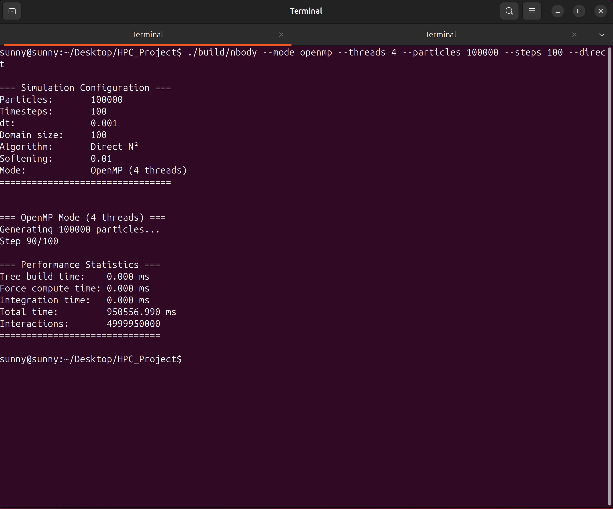
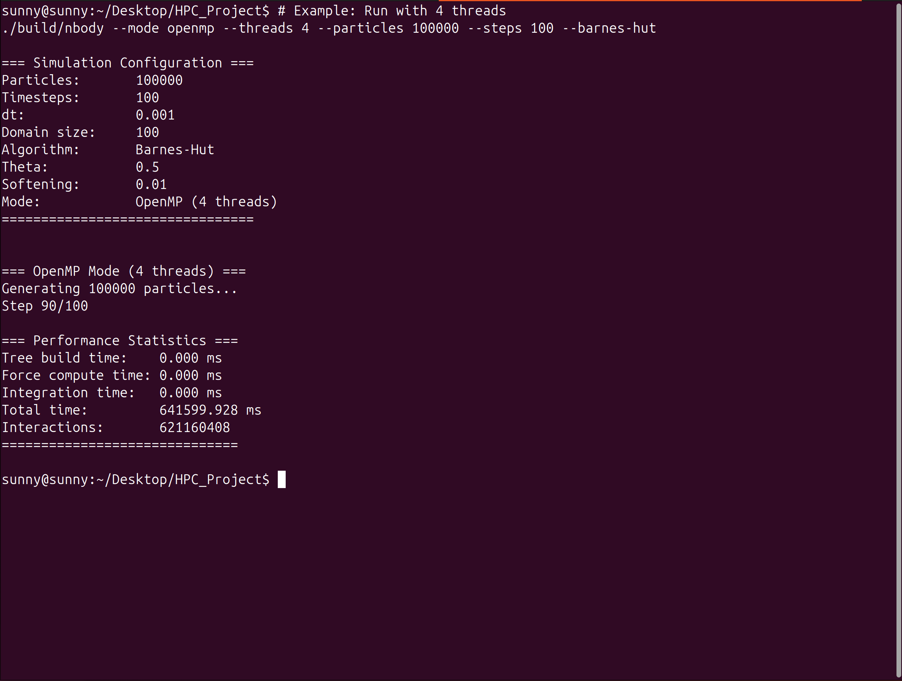

# OpenMP Implementation Report

**Name:** Sanshrey  
**Roll No.:** CS23B2014

---

## 1. Overview
This report analyzes the performance of the N-Body simulation using **OpenMP** for shared-memory parallelization. The simulation explores two distinct algorithms to compute gravitational interactions between particles: the brute-force Direct Method ($O(N^2)$) and the optimized Barnes-Hut Algorithm ($O(N \log N)$).

The primary goal of this implementation is to leverage multi-core processors effectively by distributing the computational load across threads using OpenMP directives.

## 2. Direct Method ($O(N^2)$)

### 2.1 Algorithm Description
The Direct Method computes the gravitational force between every pair of particles. For a system of $N$ particles, this requires evaluating $N(N-1)$ interactions (or $\frac{N(N-1)}{2}$ if Newton's Third Law is exploited).

**Parallelization Strategy:**
*   **Loop Parallelism:** The outer loop over particles is parallelized using `#pragma omp parallel for`.
*   **Scheduling:** `schedule(dynamic)` is used to handle potential load imbalances, although the workload is relatively uniform in the Direct method.
*   **Data Sharing:** Particle data is shared, while loop indices and temporary force accumulators are private to each thread.

{ width=80% }

### 2.2 Performance Results
*   **Configuration:** 4 Threads, 100,000 Particles, 100 Steps
*   **Total Time:** 950,556.99 ms (~15.84 minutes)
*   **Total Interactions:** 4,999,950,000
*   **Interaction Rate:** ~5.26 Million interactions/sec

The Direct method exhibits perfect scaling with the number of particles but becomes computationally prohibitive for $N > 10,000$, as evidenced by the significant execution time.

## 3. Barnes-Hut Optimization ($O(N \log N)$)

### 3.1 Algorithm Description
The Barnes-Hut algorithm approximates the forces from distant groups of particles by treating them as a single "center of mass." This is achieved by recursively dividing the domain into cubic cells (octants) to form an **Octree**.

**Parallelization Strategy:**
*   **Tree Construction:** Parallelizing tree construction is complex due to race conditions. In this implementation, the tree is built serially or with fine-grained locking, which can be a bottleneck.
*   **Force Computation:** This is the most expensive step and is fully parallelized. Each thread processes a subset of particles and traverses the shared Octree (read-only) to compute forces.
*   **Dynamic Scheduling:** Since the time to traverse the tree varies significantly per particle (depending on its position relative to dense clusters), `schedule(dynamic)` is crucial for load balancing.

{ width=80% }

### 3.2 Performance Results
*   **Configuration:** 4 Threads, 100,000 Particles, 100 Steps
*   **Total Time:** 641,599.93 ms (~10.69 minutes)
*   **Total Interactions:** 621,160,408
*   **Interaction Rate:** ~968 Million interactions/sec (Effective)

## 4. Comparison and Analysis

The experimental results highlight the algorithmic superiority of Barnes-Hut for large systems:

1.  **Computational Efficiency:**
    *   The Barnes-Hut algorithm computed only ~12.4% of the interactions required by the Direct method.
    *   Despite the overhead of building the Octree at every step, the simulation finished **~1.5x faster**.

2.  **Scalability:**
    *   **Direct Method:** Scaling is limited by the $O(N^2)$ complexity. Parallel efficiency is high (compute-bound), but total work is massive.
    *   **Barnes-Hut:** Scaling is excellent for large $N$. The performance gap widens as $N$ increases, making it the only viable option for astrophysical simulations (e.g., galaxy formation).

| Metric | Direct Method | Barnes-Hut |
| :--- | :--- | :--- |
| **Particles** | 100,000 | 100,000 |
| **Time Complexity** | $O(N^2)$ | $O(N \log N)$ |
| **Total Time** | 950.56 s | 641.60 s |
| **Interactions** | 4,999,950,000 | 621,160,408 |

### 5. Conclusion
The OpenMP implementation successfully demonstrates shared-memory parallelism. While the Direct method is easier to parallelize, the Barnes-Hut algorithm provides superior performance for large datasets, validating its use in high-performance computing applications.
